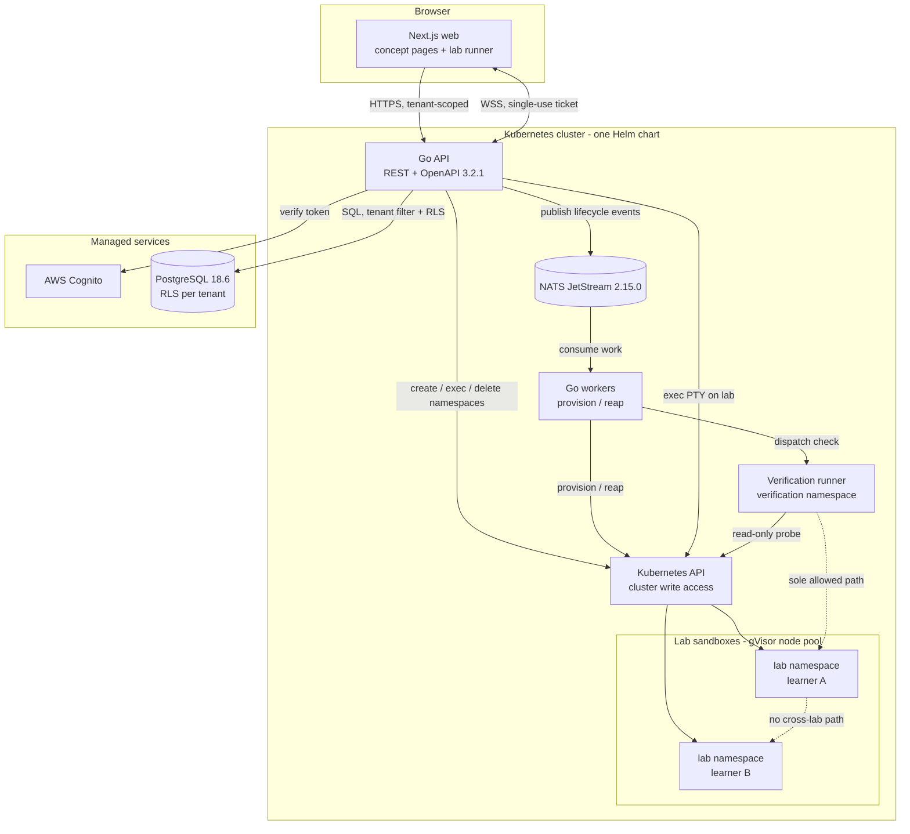

# System Architecture

Derived from `docs/research/001-stack.md` and `002-lab-isolation.md`. Decisions are
recorded in `docs/adr/`. Choices left open upstream are flagged, not closed.

## Components

| Component | Tech | Responsibility |
|---|---|---|
| Web | Next.js 16.4.0, React 19.3.0, xterm.js | Concept pages (SSR) and the lab runner. Holds no cluster credentials. |
| API | Go 1.27.1, REST + OpenAPI 3.2.1 | Auth, tenant and role checks, lab lifecycle, terminal relay, progress. |
| Workers | Go 1.27.1, NATS JetStream consumers | Provision, verify, reap. Separate from the API so a slow lab cannot exhaust the interactive path. |
| Verification runner | Go 1.27.1, pod in the verification namespace | Asserts on real system state. Never inside a learner's lab, never in the control plane (ADR 0002). |
| Tenant data | PostgreSQL 18.6, managed, RLS per tenant | Institutions, users, roles, labs, completion. RLS backstops application checks. |
| Event bus | NATS JetStream 2.15.0 | Durable queues for provisioning, verification, teardown, reaping. |
| Identity | AWS Cognito | Credentials and tokens. No business identifier lives here. |
| Lab sandboxes | Kubernetes pods, `runtimeClassName: gVisor`, dedicated node pool | The learner's throwaway system. One namespace per lab, hard TTL, PSS `restricted`. |

Inside the cluster everything ships as one Helm chart (ADR 0001). Cilium and the lab
node pool are cluster-level, configured by Terraform rather than by the chart.

## Repo layout

pnpm workspaces for web, one Go module for API and workers.

```
apps/web        Next.js, pnpm workspace
services/api     Go, cmd + internal
services/workers Go, same module
charts          the single Helm chart
infra           Terraform
docs            product, research, architecture, adr, plans, tasks, reviews
```

One Go module covering API and workers keeps a single `go.sum` and lets the runner
share types with the workers that dispatch it. They deploy as separate binaries from
one module.

pnpm workspaces rather than a single package: web will grow a second package for the
terminal component, and workspaces need no new tooling for that.

Turborepo is not worth it here. It caches task output, and the tasks are one Next.js
build, two Go builds, lint, and test. Go builds do not benefit from a JavaScript task
runner, so Turborepo would wrap `next build` and add a dependency for that. Revisit
when there are three or more web packages with interdependent builds.

## How they talk

- Browser to API: HTTPS. WebSocket for terminal I/O only.
- Browser to terminal: single-use ticket scoped to one lab, ~30s TTL. The API opens the
  PTY with its own ServiceAccount. No kubeconfig, API token, or SSH key reaches the
  browser.
- API to Postgres: TLS, tenant filter on every query plus RLS.
- API to workers: NATS JetStream subjects, at-least-once, per-consumer replay.
- API and workers to Kubernetes API: the only components holding cluster write access,
  scoped to lab namespaces.
- Verification runner to lab: one explicit NetworkPolicy path. The only permitted
  exception to default-deny (ADR 0002).
- Lab service endpoints: proxied through the API under the same authorization check,
  never exposed by Ingress.
- Labs to the internet: default-deny egress, DNS re-allowed, mirrors allow-listed,
  public traffic through an operated proxy.



## Open items

**Observability is unspecified.** No logging, metrics, or tracing stack is chosen. This
is a security gap, not just a tooling gap: `002-lab-isolation.md` risk 7 names log
pipelines as a likely tenancy leak path. An OTel collector is the obvious candidate.

## Sizing

5k concurrent labs is a peak figure (ADR 0002). Sizing lands in roadmap E6.

Every terminal byte and proxied service call passes through the API, so the API's
connection ceiling is the first capacity limit, ahead of the database's.
