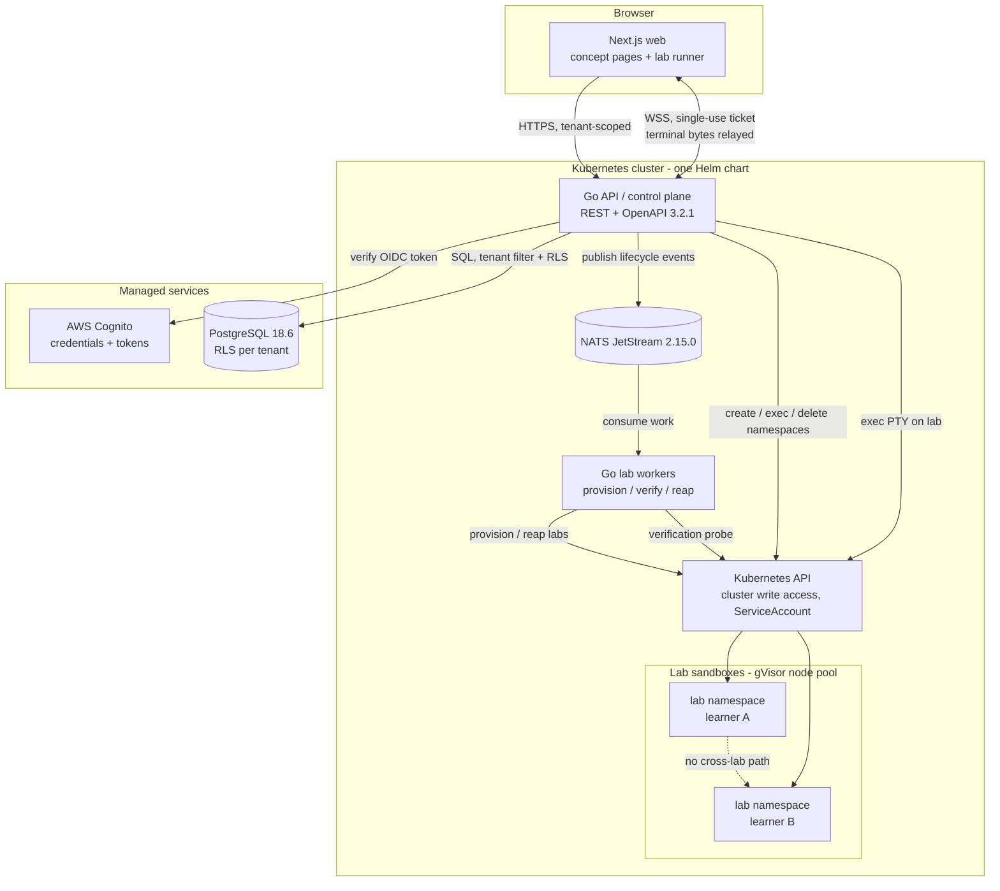

# System Architecture

Derived from `docs/research/001-stack.md` and `docs/research/002-lab-isolation.md`.
Component choices are not re-litigated here; where a choice was left open upstream this
document flags it rather than closing it. See "Open decisions" at the end.

## Components

| Component | Tech (from 001/002) | Responsibility |
|---|---|---|
| Web | Next.js 16.4.0, React 19.3.0, xterm.js | Concept pages (SSR) and the lab runner: terminal UI, objective checklist, progress display. Holds no cluster credentials. |
| API / control plane | Go 1.27.1, REST + OpenAPI 3.2.1 | Authentication of requests, tenant and role checks, lab lifecycle requests, terminal WebSocket relay, verification orchestration, progress reads and writes. |
| Lab workers | Go 1.27.1, NATS JetStream consumers | Provision, verify, and reap labs. Split from the API so a slow lab operation cannot exhaust the interactive path (002 risk 4). |
| Tenant data | PostgreSQL 18.6, managed, RLS per tenant | Institutions, users, roles, rosters, lab records, objective completion. RLS is the database-enforced backstop behind application checks. |
| Event bus | NATS JetStream 2.15.0 | Durable queues for provisioning, verification, teardown, reaping; fan-out for progress events. |
| Identity | AWS Cognito | Credential storage and token issuance only. No business identifier lives here (001). |
| Lab sandboxes | Kubernetes pods, `runtimeClassName: gVisor`, dedicated node pool | The learner's throwaway system. One namespace per lab, hard TTL, PSS `restricted`, no service account token. |

Everything inside the cluster ships as one Helm chart, per the 001 deployment
constraint: web, API, workers, and the sandbox configuration that is static enough to
chart. See conflict C1 about what that constraint can and cannot cover.

## How they talk

- **Browser to API.** HTTPS for all requests, WebSocket for terminal I/O only.
- **Browser to terminal.** The browser receives a single-use WebSocket ticket scoped to
  one lab with a ~30s TTL, opens WSS to the API, and the API opens the PTY using its own
  in-cluster ServiceAccount (002 section 3). No kubeconfig, no API token, and no SSH key
  ever reaches the browser.
- **API to Postgres.** Standard TLS connection, managed service, tenant filter on every
  query plus RLS as backstop.
- **API to workers.** NATS JetStream subjects, at-least-once, per-consumer replay.
- **Workers to Kubernetes API.** ServiceAccount with the narrowest verbs that still
  create and exec into lab namespaces. This is the only component that holds cluster
  write access.
- **Lab service endpoints.** Anything a learner needs to reach inside the lab (a broker
  to publish to, a node to curl) is proxied through the API under the same authorization
  check, never exposed directly by Ingress.
- **Labs to the outside world.** Default-deny egress, DNS explicitly re-allowed,
  package mirrors allow-listed. Public internet only through an operated proxy.

## Sizing notes

5k concurrent labs is the target in `docs/product/vision.md`, but `mvp.md` still lists
as an open question whether that is a worst-case peak or a sustained average. Both
change this architecture, so no capacity numbers are committed here. See C2.

Every terminal byte and every proxied service call passes through the API, so the API's
connection ceiling, not the database's, is the first capacity limit we will hit (002
risk 4).

## Open decisions and conflicts

These are flagged rather than resolved. Each needs a decision from the product or
architecture owner before implementation planning.

**C1. The single-chart and single-cluster constraints conflict with the CNI, the node
pool, and EU residency.** The 001 constraint is one cluster via one Helm chart. But
002 requires Cilium (NetworkPolicy enforcement does not exist without an enforcing
CNI) and a dedicated lab node pool with taints, and neither is chart-managed content in
the normal sense. Separately, `vision.md` and `mvp.md` require EU as a
tenant-selectable option while 001 specifies a single managed PostgreSQL. One cluster
cannot be in two regions. The likely shape is the same chart deployed to two clusters
with a resolver routing a learner to their tenant's region, but that is a product and
cost decision, not mine to make.

**C2. Vision states a concurrency figure that mvp.md lists as undecided.**
`vision.md` records "5k peak, sustained" as a committed measure while `mvp.md` asks
whether 5k is worst-case peak or sustained average. One of the two documents is
out of date. Sizing for sustained means buying capacity for the whole day; sizing for
peak means accepting exhaustion events.

**C3. Lab verification has no agreed home.** MVP feature 3 requires asserting on real
system state, and 002 says verification must not execute learner-controlled code in
the control plane. Whether checks run as a sidecar inside the lab namespace or in a
separate sandbox with its own access to lab state is unresolved, and it changes the
worker's permissions, the network policy, and what a compromised lab can reach.

**C4. gVisor overhead is unmeasured against a committed target.** `vision.md` commits
to p50 lab boot under 10s. 002 risk 2 states the overhead exists but is unbenchmarked
for our pod sizes on our node types. Until that is measured, the vision figure is a
target we have not validated.

**C5. Observability is unspecified.** Neither research doc chose a logging, metrics, or
tracing stack, and 002 risk 7 names log pipelines as a likely tenancy leak path. An
OTel collector is the obvious candidate but no decision exists, so none is recorded
here.

**C6. mvp.md's open questions are now partly stale.** 002 recommends gVisor and answers
the isolation question, but 002 itself says the recommendation is "not decided" and
mvp.md still lists sandbox isolation as open. The documents should be reconciled by
whoever owns mvp.md; I have not edited it, as that is outside this task.
